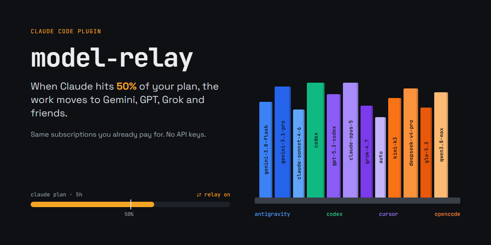
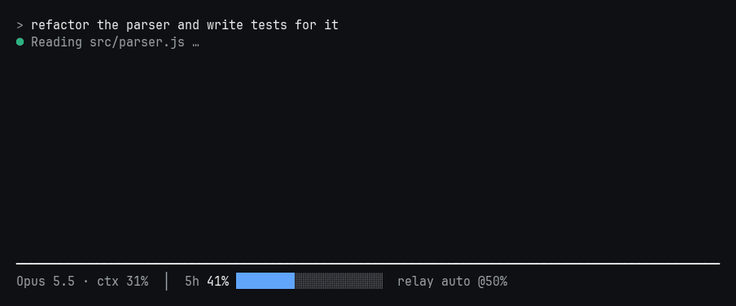

<p align="center"></p>

# model-relay

A Claude Code plugin that hands work to **other models** — Gemini, GPT, Grok,
Kimi, DeepSeek and more — through CLIs you are **already logged into**. No API
keys, no extra bills: it spends the subscriptions you already pay for.

- **Automatic relay.** When your Claude plan reaches **50%** of its 5-hour or
  weekly limit, Claude starts delegating self-contained work to other models,
  and stops again when usage drops.
- **Manual relay.** `/relay on` switches it on from your next message, whatever
  your usage. `/relay off` and `/relay auto` do what they say.
- **Claude picks the model and the effort** per task: `low` for bulk triage,
  `high` for the hard calls.
- **`/shelf`** shows every backend and model as books on a shelf.

<p align="center"></p>

## Install

```text
/plugin marketplace add AGHEORONO/model-relay
/plugin install model-relay@model-relay
```

Restart Claude Code. That's it — the MCP server ships pre-bundled, so there is
no `npm install`.

On first start the plugin installs a small **status line**. It has to: the
status line is the only place Claude Code reports plan usage. If you already
have one, nothing is replaced — run `/relay setup` and yours keeps running with
the relay segment appended.

**Requirements:** Node 18+, and at least one of these CLIs, signed in:

| Backend | CLI | Sign in | Effort flag |
|---|---|---|---|
| `antigravity` | [Antigravity](https://antigravity.google) `agy` | run `agy` once | `--effort` |
| `codex` | [Codex CLI](https://developers.openai.com/codex) | `codex login` | `model_reasoning_effort` |
| `cursor` | [Cursor Agent](https://cursor.com/cli) | `cursor-agent login` | in the model id |
| `opencode` | [opencode](https://opencode.ai) | `opencode auth login` | `--variant` |

Installed CLIs are detected from `PATH` automatically. API keys work too
(`GEMINI_API_KEY`, `OPENROUTER_API_KEY`, `OPENAI_API_KEY`, …) and are billed per token.

## Commands

Plugin commands are namespaced — type `/shelf` or `/relay` and pick the
`model-relay:` entry.

| Command | What it does |
|---|---|
| `/relay` | Mode, threshold and current plan usage |
| `/relay on` · `off` · `auto` | Manual on, manual off, or automatic at the threshold |
| `/relay threshold 60` | Change the auto threshold (default 50) |
| `/relay window 5h` | Watch only the 5-hour limit (`7d` for weekly, `any` = both) |
| `/relay setup` · `uninstall` | Install or remove the status line |
| `/relay stats` · `/relay stats 7` | Delegated calls and estimated Claude tokens saved |
| `/shelf` · `/shelf cursor` · `/shelf all` | See the models |

<p align="center"></p>

<p align="center"></p>

## How it works

```
 status line ──► ~/.claude/model-relay/usage.json      (5h %, weekly %)
                          │
 every prompt ──► UserPromptSubmit hook ── below threshold ──► prints nothing (0 tokens)
                          │
                    ≥ threshold or /relay on
                          ▼
           one-line note: "delegate self-contained work"
                          ▼
     Claude ──► model-router MCP ──► agy · codex · cursor-agent · opencode
```

- **Cheap when idle.** Below the threshold the hook prints nothing, so it adds
  no tokens to your conversation.
- **Claude stays in charge.** It still reads your repo, runs tools and checks
  what comes back. What moves out is the self-contained work: drafts,
  summaries, reviews, research answers and bulk analysis. Relay cuts Claude
  usage; it does not bring it to zero.
- **Files go by path, not by paste.** `files` / `input_files` make the server
  read files itself, so Claude never spends output tokens copying code into a
  prompt. Credential files (`.env`, keys, `.ssh/`) are refused.
- **Results go to disk, not through Claude.** With `output_file` the server
  writes the delegate's answer (code, tests, docs) straight to the file; Claude
  only runs or reads it to check, instead of re-typing it.
- **Measured, not guessed.** Every delegated call is logged (sizes only, never
  content) to `~/.claude/model-relay/ledger.jsonl`; `/relay stats` turns it into
  an estimate of Claude tokens saved.
- **Safe by default.** Every delegated call runs in a fresh empty temp
  directory (`--sandbox` / read-only where the CLI supports it), so the other
  agent cannot see or touch your project. It gets only the prompt Claude writes.

## MCP tools

| Tool | |
|---|---|
| `ask_model` | One prompt to one model. `model`, `prompt`, optional `effort`, `files`, `output_file`, `system` |
| `ask_models` | The same prompt to several models in parallel, for second opinions |
| `map_prompt` | One template over many inputs (`inputs` or `input_files`), for bulk work |
| `list_models` / `list_providers` | What is installed, and which effort levels each backend honours |

## Development

```bash
cd server
npm install
npm run build     # bundles src/ into dist/server.mjs (commit it)
npm run check     # selftest: detected backends + model probe
npm run shelf
python ../assets/src/make_gifs.py <shelf-output.txt>   # regenerate the GIFs
```

## License

MIT
